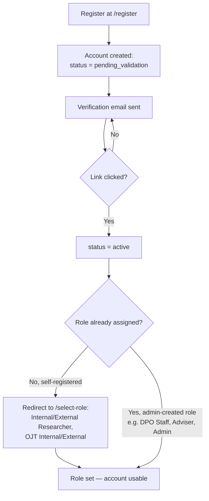
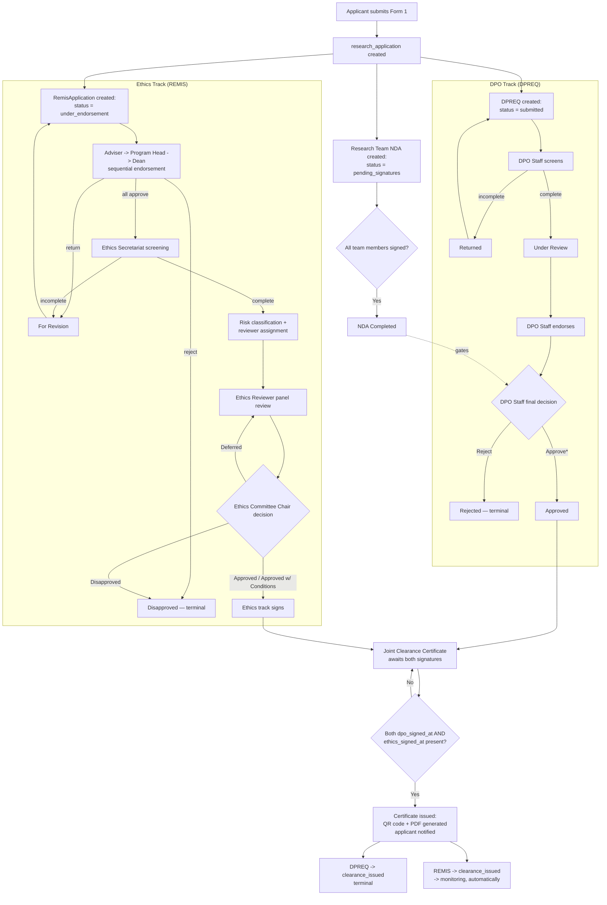
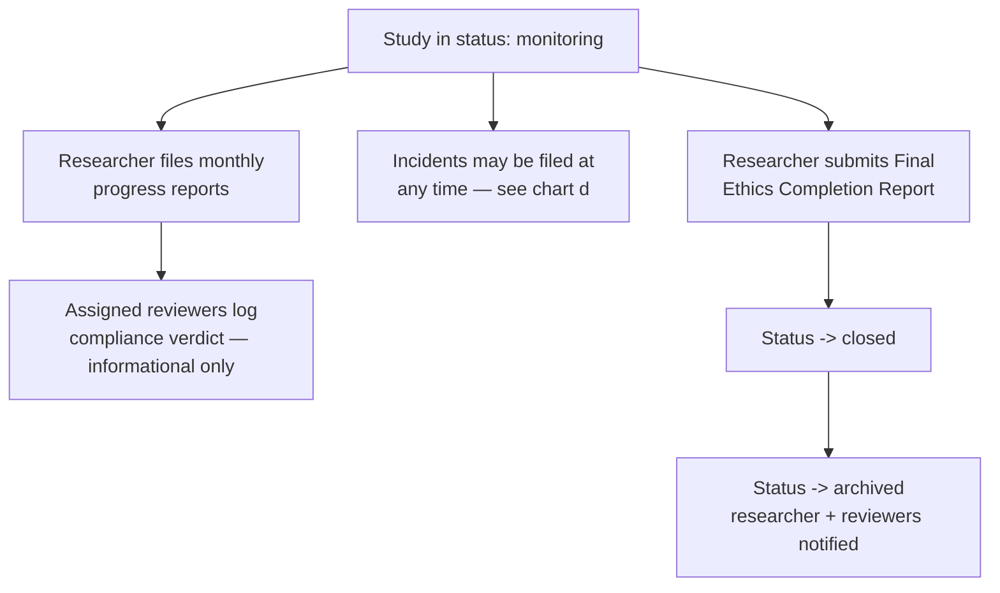
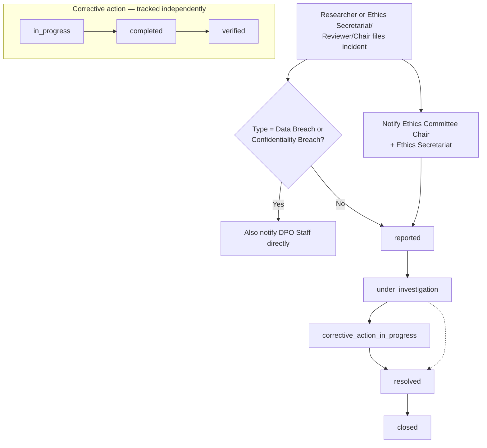
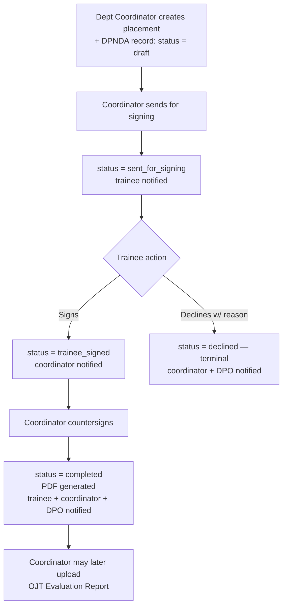

# PCC-EDMS — Workflow Charts

Diagrams below use [Mermaid](https://mermaid.js.org/) syntax — they render automatically in
GitHub, GitLab, VS Code (with the Mermaid extension), and most modern Markdown viewers. Every
state name is taken directly from `docs/WORKFLOWS.md`, which was itself cross-checked against
the running code, not just the design docs.

---

## a) Account registration → role selection

A new user's account is a shell until they verify their email and pick a role — but only for
self-registering "applicant" roles. Every internal review role (DPO Staff, Ethics Secretariat,
Adviser, Admin, etc.) is created directly by an Administrator and skips this flow entirely.

---

## b) DPREQ + REMIS — one submission, two tracks, joint clearance

The central workflow of the system: a single Form 1 submission fans out into a DPO track and an
Ethics track that run independently, then converge on one clearance certificate.

*\* DPO Staff's final approval is blocked until the Research Team NDA is fully signed (dotted gate above).*

---

## c) REMIS Monitoring → Completion

---

## d) Incident reporting — independent of study status

---

## e) DPNDA — OJT/Trainee NDA (Form 5)

A separate workflow from (b) above — it belongs to a placement, not a research study, and is
started by the Department Coordinator, not the trainee.

