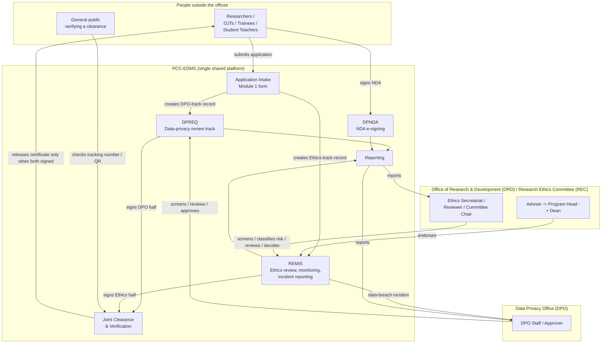

# PCC-EDMS — System Context Diagram

Stakeholder-level view: what the system is, who touches it, and how information flows between
the two owning offices. Deliberately excludes implementation detail (no class names, table
names, or schema) — see `docs/architecture.md` and `docs/system-design.md` for the technical
version this is derived from.

---

## System context

---

## Reading this diagram

- **One front door:** researchers interact with a single intake form, not separate DPO and
  Ethics forms.
- **Two independent back-office tracks:** DPO's review and the Ethics Committee's review happen
  in parallel and don't wait on each other — except at the very end.
- **One convergence point:** the joint clearance certificate is the only place the two tracks'
  outputs meet, and it enforces a hard rule — no release until both offices have signed.
- **One cross-office notification:** REMIS-side data-breach or confidentiality-breach incidents
  are the one case where the Ethics side directly notifies DPO — because a privacy breach inside
  a REC-cleared study is a DPO matter regardless of which office's process surfaced it.
- **DPNDA is separate:** OJT/trainee NDAs are not part of the research-application flow at all —
  they belong to placements, run by Department Coordinators (not shown above since they sit
  outside DPO/ORD as host-department staff).
- **Reporting reads across everything:** both offices get reports computed from the same
  underlying application data, without manual compilation.
